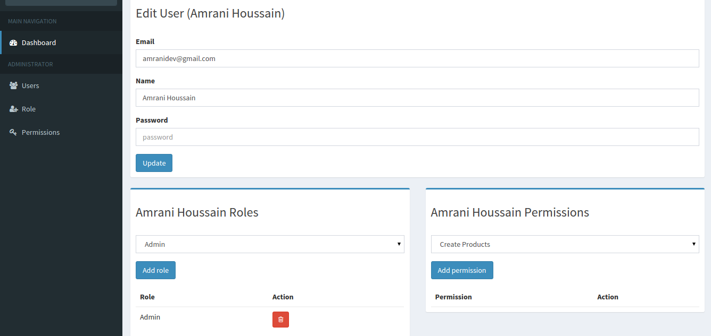
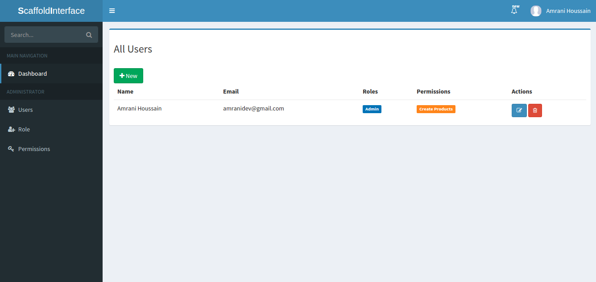

### Control panel Admin-LTE

Scaffold-interface provids a simple control panel containing user management system using [laravel-permission](https://github.com/spatie/laravel-permission) package to menage users-roles-permissions easily.

- Go a head to terminal and create a new user.

 `$ php artisan tinker`

 ```php
	$user = new \App\User();
	$user->name = "john doe";
	$user->email = "jhondoe@example.com";
	$user->password = Hash::make("password");
	$user->save();
 ```

Then click on dashboard button and login.

#### Screenshots






- You can determine if a user has a certain role:

`$user->hasRole('writer');`

- You can also determine if a user has any of a given list of roles:

`$user->hasAnyRole(Role::all());`

- You can determine if a role has a certain permission:

`$role->hasPermissionTo('edit articles');`

Want more ? check [laravel-permission](https://github.com/spatie/laravel-permission).

> NOTE: Dashboard routes are located in vendor/amranidev/scaffold-interface/src/Http/routes.php, feel free to change anything you want.
