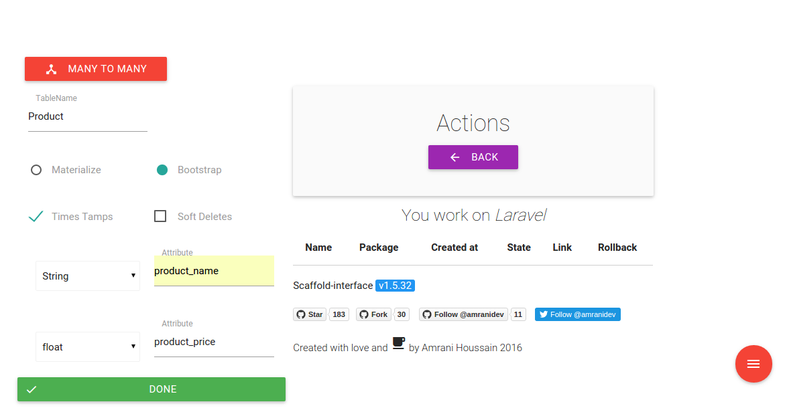
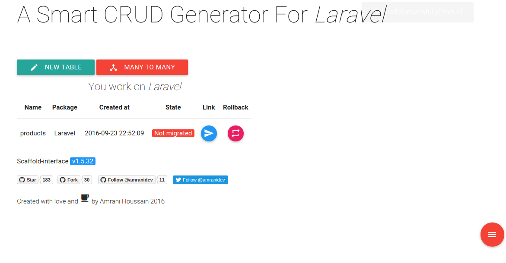
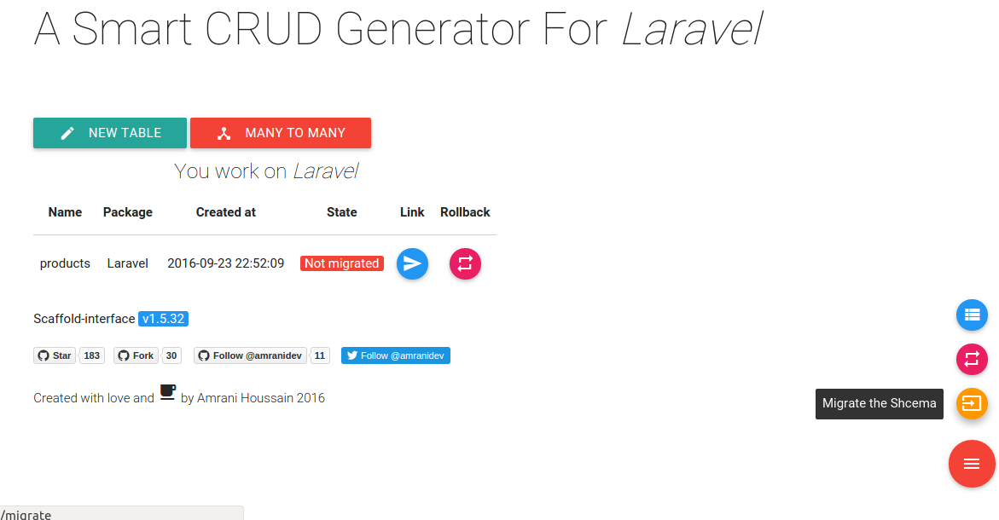

### Usage

> make sure that you have installed scaffold-interface correctly

Scaffold interface provides a simple way to create (CRUD), models/views/controllers and relationships as OneToMany/ManyToMany.

Scaffold-interface is definitely quite simple, all you have to do is click here and there to get it done.

Let's begin.

+ Go to `http://{your-project-url}/scaffold`.

+ Click on new table and fill the form, then click on ready and done button.

+ MVC files has been generated.

+ Migrate your schema to the database by clicking on the Migrate button.

Well, your model is ready to use.

> To delete your entity just rollback its table from database clicking on rollback button first, then click on delete button to be deleted from your app.