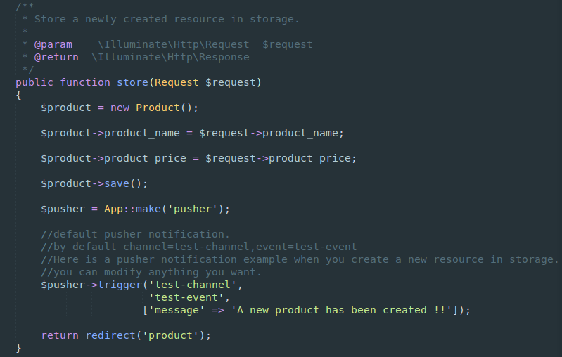

### Pusher notification


#### What is pusher ?

Pusher is a hosted service that makes it super-easy to add real-time data and functionality to web and mobile applications.

Pusher sits as a real-time layer between your servers and your clients. Pusher maintains persistent connections to the clients - over WebSocket if possible and falling back to HTTP-based connectivity - so that as soon as your servers have new data that they want to push to the clients they can do, instantly via Pusher.

Pusher offers libraries to integrate into all the main runtimes and frameworks. PHP, Ruby, Python, Java, .NET, Go and Node on the server and JavaScript, Objective-C (iOS) and Java (Android) on the client.

Pusher is a highly scalable real-time solution established in 2010 and has lots of awesome customers including GitHub, MailChimp, CodeShip, The Financial Times, UserVoice, Travis CI and QuizUp.

Before we get started, you have to create a pusher account.

Please sign up for a free Pusher account via [pusher.com/signup](pusher.com/signup), and create a new app via Pusher dashboard.

#### Configuration

Go to .env and define (app_id,key,and secret).

```
PUSHER_APP_ID = your_app_id
PUSHER_KEY = your_key
PUSHER_SECRET = your_secret
```

Go to config/pusher.php and define pusher credentials env.

```php
    'connections' => [

        'main' => [
            'auth_key' => env('PUSHER_KEY'),
            'secret' => env('PUSHER_SECRET'),
            'app_id' => env('PUSHER_APP_ID'),
            'options' => [],
            'host' => null,
            'port' => null,
            'timeout' => null,
     ],
```

#### Channels & Events

By default Scaffold-Interface used test-channel as a channel and test-event as an event.

So when you create a new entity, the package creates back-end pusher notification code automatically behind the scenes.

Check the Entity Controller, we took our previous example, Product entity.



The fornt end code was already defined in resources/views/scaffold-interface/layouts/app.blade.php.