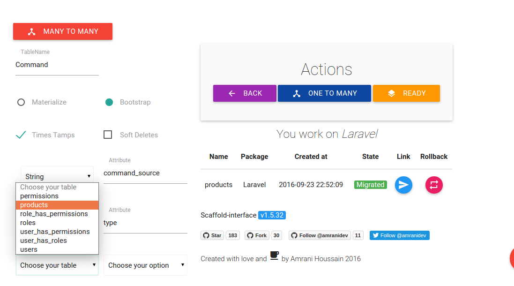
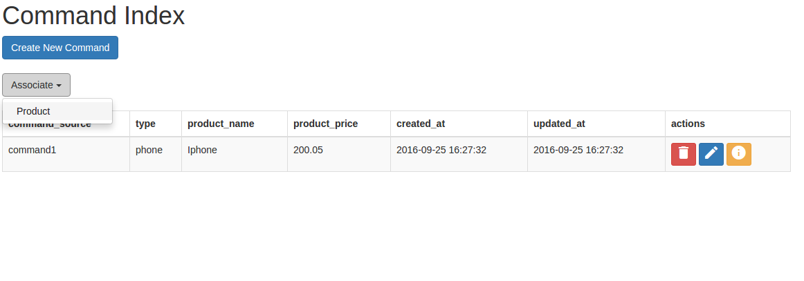

### Generating OneToMany relationship

This package provides a simple short way to generate a OneToMany relationship.
We could use our previous example Product entity.

So let's create a new entity called Command.

Before ending creation, click on OneToMany button, choose product table, choose an associated field and click on OneToMany Button again to be confirmed.

This will create a model with relation methods, views, controller and migration file containing foreign keys, for sure you can change whatever you want.

Then click on migration button.

